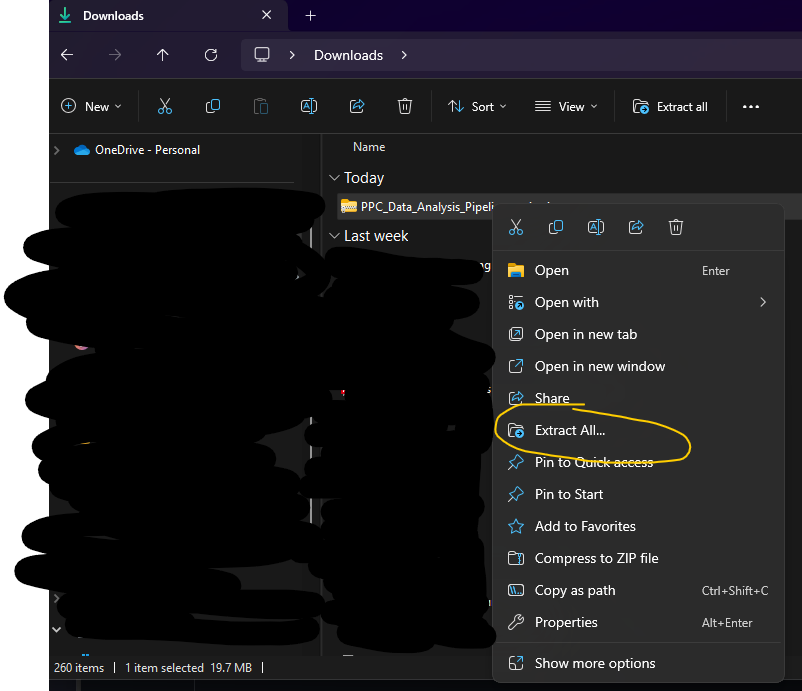

# Priceless Planet Coalition Data Analysis Pipeline

## Overview
This repository houses the data processing/analysis scripts for dealing with PPC
monitoring data. The most important folder here is the 'Scripts' folder, which 
contains executable R scripts, each of which perform a different essential function.
Some of these scripts need to be executed in a certain order, because outputs of
one will become inputs to the next. Others can be run as standalone scripts. 

The other folders in the repository contain key information that enable the scripts
to run seamlessly. It is is important not to change the directory structures! Do
not rename folders or move them around. The scripts will all assume that the parent
folder in this repository is set as the working directory, and as such when they
search for necessary files, if they are renamed or moved, they will not be able to
run.

## How to download
If you are familiar with git, you can clone the repository in a directory of your 
choice. If not, the simplest way is to click on the green code button in the top
right corner of the repository page, and then 'Download Zip'. Here is a screenshot:

After this, unzipping will look slightly differently if you're on a Mac, but find
this zipped file and extract its contents into a location of your choosing. This
is what that looks like on PC:

After you've unzipped it, you should have a replica of this GitHub repository on
your local machine. If the repository is every updated (with fixes, etc.), you 
will need to re-download the zip. 

## What is in this repository?

* **Scripts:** This folder houses the scripts that perform all the functions:
  * **Extract_Main_Data.R:** a script to extract data from Kobo toolbox, process it, 
  and create CSV files.
  * **Extract_Brazil_Data.R:** This script does the same as the above, but handles the
  particularities of the Brazil data accordingly. 
  * **Correct_Species_Names.R:** This script automatically corrects most species names
  and provides functionality for the user to correct the rest.
  * **Add_Family_Names.R:** This script uses online databases to search for and add
  taxonomic family names to the dataset.
  * **Analyze_Data.R:** This processes the cleaned and wrangled dataset to generate
  baseline reports, as well as data pertaining to the PPC indicators such as 
  trees restored, trees naturally regenerated, and survival rate of planted trees.
  * **IMP_Invasive_Species_Scanner.R:** This script takes an exported IMP data file, 
  preprocesses it, and then scans the planted species for potential invasives.
  * **IMP_Native_Alien_Classification.R:** This script aids in the process of 
  classifying native and alien species.
  * **Invasive_Species_Scanner.R:** This is a standalone version of the invasives 
  scanner that can be used on a simply formatted species list.
  
  
* **Species_Data** This folder houses the taxonomic corrections data.
  * **Taxonomic_Corrections_YYYY-MM-DD_HHMM.csv:** Files with this naming convention
  will be generated each time certain scripts are run. These are cumulative records
  of species name corrections. At handover, the file here contains thousands of corrections,
  and it will serve as the base for future corrections. 
  * **Family_Names_YYYY-MM-DD_HHMM.csv:** This is a similar file, only it has up
  to date family names information.

* **IMP_Data** This folder houses the exported IMP planting data, as well as the
folders and files associated with processing it.
  * **ppc_export_site_submissions_....csv:** This is a direct IMP export. I did not 
  change the naming convention here, assuming that all exports would follow the
  same convention. The important pattern that my code will look for is "ppc_export."
  This export contains site information and planting data for tree and seed species.
  * **GBIF_dataset_keys.csv: ** These are manually curated dataset keys for 
  introduced species checklists in the GBIF database. Leave this as is. Part of
  a script will use these keys to check for potentially introduced species. 
  * **IMP_planted_trees_YYY-MM-DD_HHMM.csv:** Files of this naming convention are
  produced after running the IMP_Invasive_Species_Scanner.R script. This one shows
  an expanded, but more easily analyzed version of the tree planting data from the
  IMP.
  * **IMP_planted_seeds_YYY-MM-DD_HHMM.csv:** Same as above, but for seed planting
  data.
  * **Checklist_Scan_Results_YYYY-MM-DD_HHMM.csv:** This keeps track of scans for 
  introduced species (which happen as a part of the IMP_Native_Alien_Classification.R
  script. The script will run without it, but it will take longer since it will
  run scans on things it has already processed.)
  * **Manually_Reviewed_Planting_Data_YYYY-MM-DD_HHMM.csv:** Files of this naming
  convention are produced after running the native/alien classification script, if 
  the user chose to manually review species/country pairs and label plant status.
  Like other such scripts, this will have cumulative results, so the most up to 
  date version should always be kept in the folder.
  * **Invasives_Data:** This folder houses the results from invasive species scans.
    * **Invasive_Species_Data_YYYY-MM-DD_HHMM.csv:** Files like this represent 
    the results of invasive species scans, including those species for which no
    invasive species data was found. This helps future runs move more quickly by
    not reprocessing names that have been processed.
    * **Invasive_Species_Report_YYYY-MM-DD_HHMM.csv:** Files like this represent
    the actual report--only showing potentially invasive species and the related
    information. 
* **Main_Data:** This folder houses the the project data pertaining to all projects
not in Brazil. Every time scripts are run, this folder will be updated with files
that have date stamps in their names. Regular cleaning of old files is not 
necessary, but is recommended.
  * **Main_Data_YYYY-MM-DD.csv:** This file contains the primary submission data
  from Kobo. Each row represents a submission and should correspond to a monitoring
  plot. 
  * **Geo_Data_YYYY-MM-DD.csv:** This file contains geolocation data for each 
  submission.
  * **Photo_Data_YYYY-MM-DD.csv:** This file contains photo data for each 
  submission.
  * **Tree_Data_Uncorrected_YYYY-MM-DD.csv:** This file contains the extracted
  tree data from Kobo in a single csv. The species names have not yet been 
  corrected. This file becomes input for that correction script.
  * **Corrected_Tree_Data_YYYY-MM-DD_HHMM.csv:** This file contains tree data
  with corrected names (or at least corrected as much as possible.)
  * **Final_Tree_Data_YYYY-MM-DD_HHMM.csv:** This is the final tree data file
  before it is passed to the analysis script. It has species names corrected and
  family names added.
  * **Tree_Data_by_PlotType:** This folder contains raw extractions from Kobo,
  broken down to the table they came from. It is primarily produced for help 
  with QC. The data here does not undergo species corrections or family name
  additions. 
  * **QC_Reports:** This folder is optionally created and populated at the end
  of the extraction scripts. It houses data intended to facilitate the identification
  of missing or misplaced tree data.
* **Brazil_Data:** This folder houses the the project data pertaining to all projects
within Brazil, since their data collection form is different. Many of the files
in this folder are analogous to the files in the Main_Data folder, so I will
only explicitly describe differences below.
  * **PACTO_data_YYYY-MM-DD.csv:** This file contains information about the PACTO
  indicators that only Brazil teams collected.
  * **DBH_data:** This folder contains the information about DBH measurements
  that only the Brazil team collected. 

  
  
  
## How to use the scripts?
  

NOTE: If you've made new species corrections or family names corrections, you 
will want to save those files and manually copy them over to the updated repo.
This repository